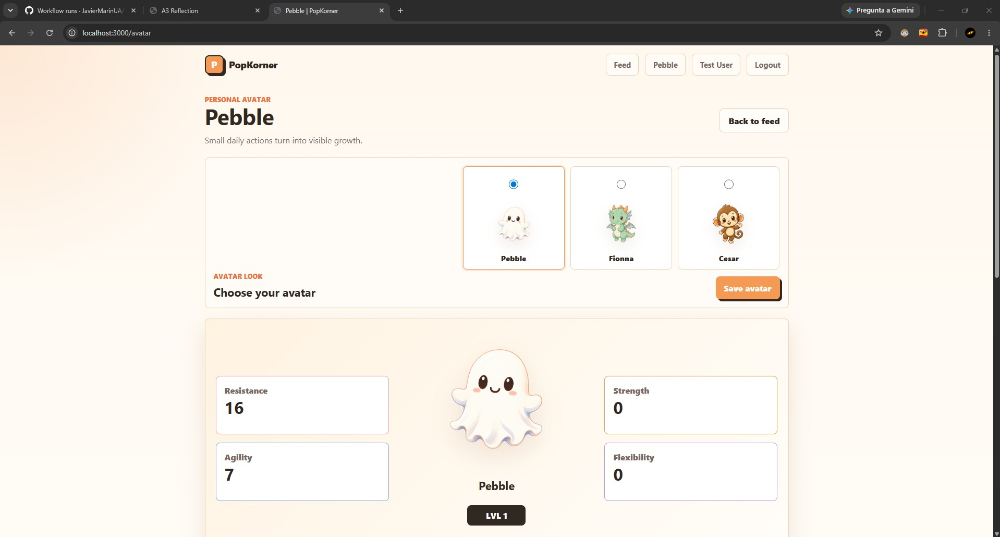
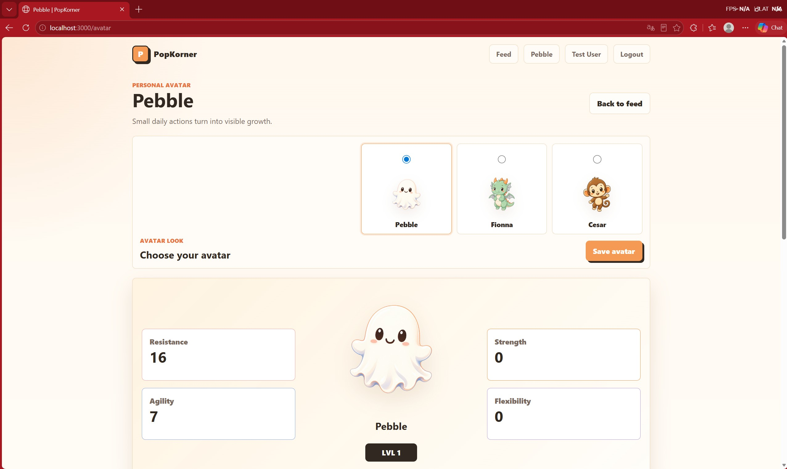
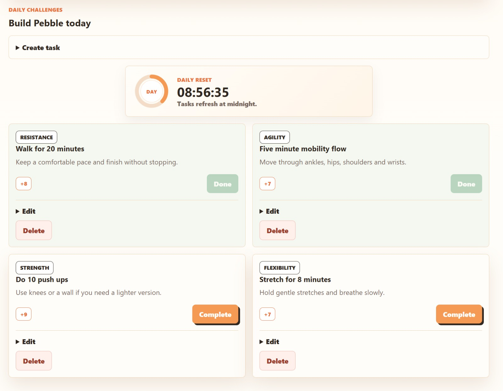
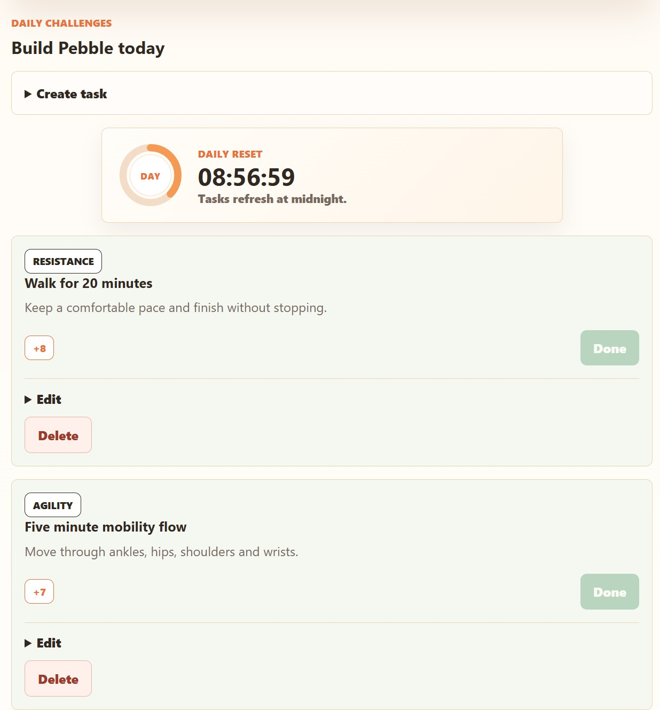
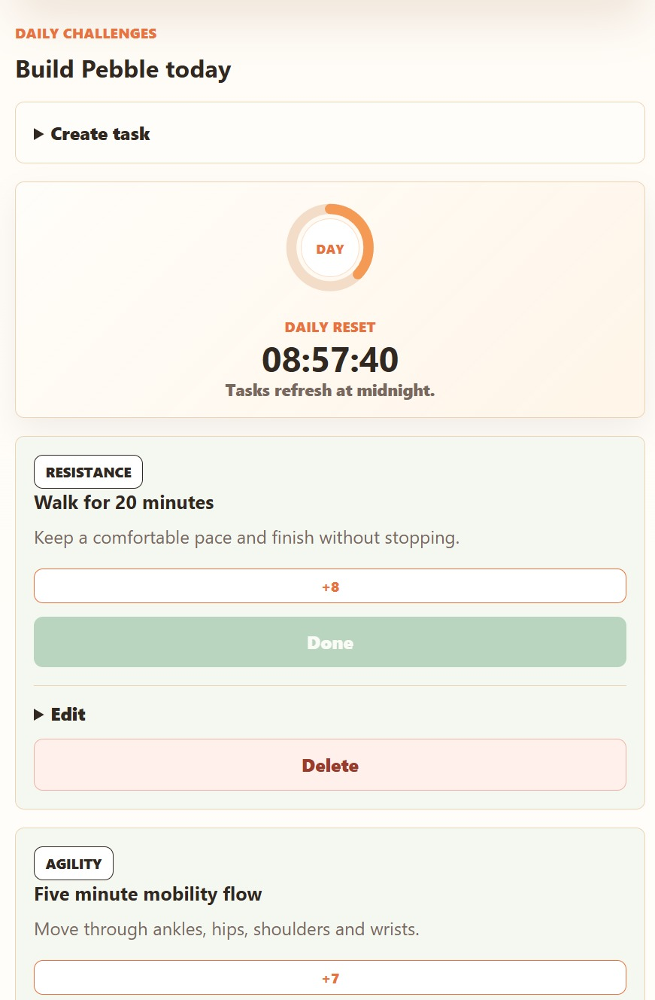
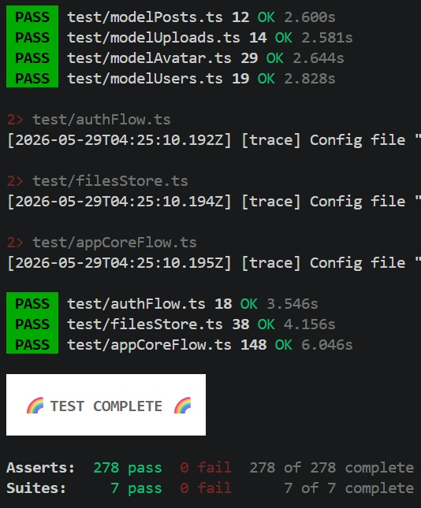
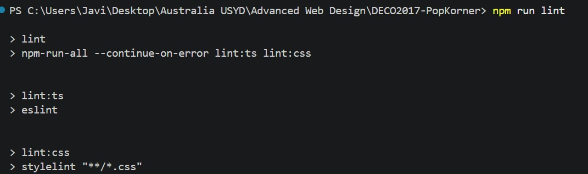
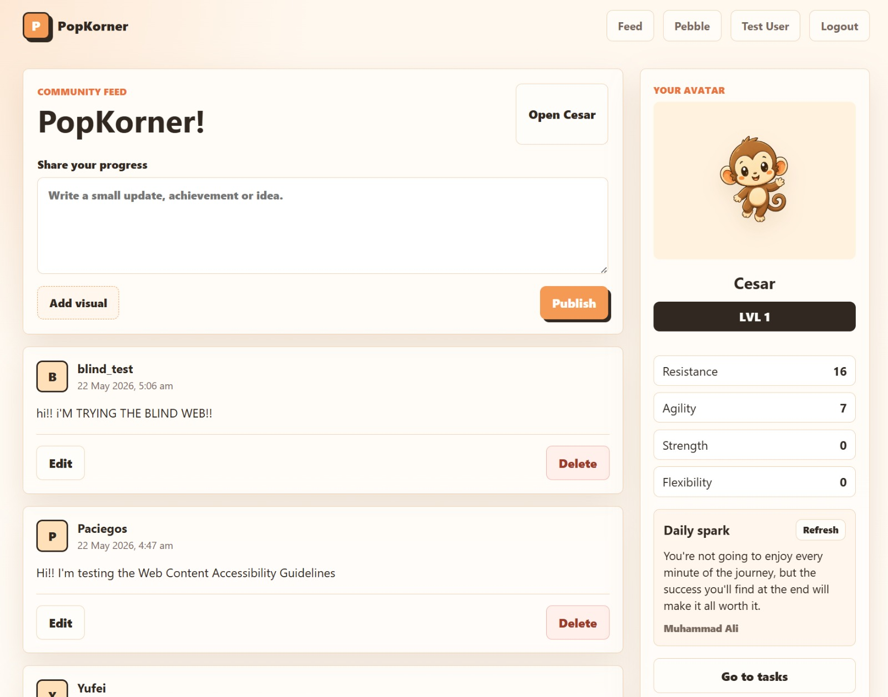
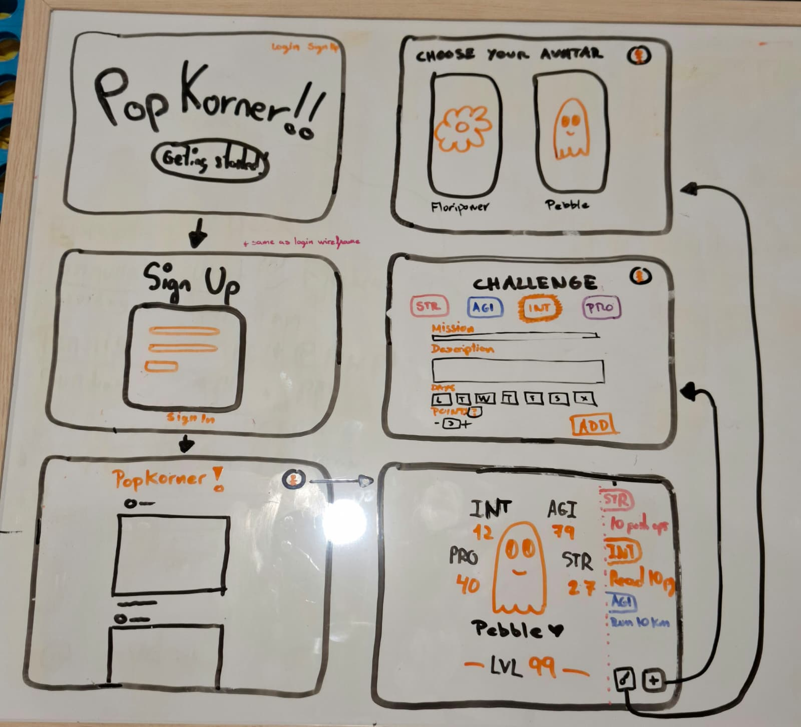

For this reflection blog, we will talk about how everything turned out and what results we achieved through our work. I will show details and explanations about different sections of the web application, while also reflecting on how the project developed and how it turned out at the end.

The reflection is separated into four main sections: Performance and Technical Behaviour, User Experience and Accessibility, Critical Reflection and Improvement Planning, and finally, Retrospective Assessment of Functional Requirements.

## 1. Performance

The loading times are fast and do not show any noticeable delay. We tested the web application in different browsers, as shown in the screenshots from Google Chrome and Microsoft Edge, and both worked in an effective and efficient way without long loading screens or database delays. Even when the user completes a task, the time needed for the stats to update is almost instant, so the user can see their progress immediately.

In terms of responsiveness, the web application is fully responsive and ready to be used on a computer, tablet or phone. We created three different responsive layouts for the website, as shown in the following images. This helps the user have a clear view of the application on any platform or device. Thanks to this, users can use the same account on different devices without any problem.

We also used multiple tools to check whether the efficiency of our web application reached a professional standard. We ran the test tools included in the template, as well as our own tests.

`npm run build:test`

In this image, we can see that all the tests passed successfully.

`npm run lint`

Here we have another positive result from the lint test. This test performs static code analysis to detect syntax errors, code quality issues and style violations before deployment.

We also used the Lighthouse tool from Google's browser, which gives feedback about different aspects of the website.

We can see how this tool shows that the website has an overall strong performance. Accessibility and Best Practices were the two best evaluated areas. SEO and Performance also received good results, although Lighthouse suggested some improvements, such as using efficient cache lifetimes or improving image delivery. We already used this tool to make some small visual changes to the project. It is a very strong tool that we could use again in the future if we had more time to keep improving the web application, especially by focusing on the SEO and Performance recommendations.

## 2. Evaluation of User Experience and Accessibility

As we can see in the final design of our feed, we used a soft and understandable colour palette based on white and orange tones. In this way, we developed a user-friendly interface that makes the website clear and intuitive to navigate. Key actions, such as the Publish button, are given greater visibility to encourage user interaction and engagement.

We can also see this pattern in the Avatar window with the CREATE TASK button and the COMPLETE button, again encouraging user interaction. These buttons make the interaction between the user and the website clearer, because the most important actions are easy to identify.

If we look at the first blog posts, we can see that we created a mockup of the website's design with the goal of following a soft colour aesthetic. For this reason, we are very happy with the final result we reached in the last version of the web application.

We also did user testing during one of the tutorials. We completed three think-aloud tests, which were very helpful because we received useful feedback to improve some aspects of the website. One example was the selection of different avatars to customise the user's experience. We had this idea during the wireframing development, but removed it later. After the user testing, we decided to add it again. Thanks to one of the tests, we also came up with the idea of creating a visual timer that shows in real time how much time is left before the day restarts and the tasks refresh. Testers liked the interface and the appearance of the website, and they said that the options were clear, easy to find and easy to understand.

## 3. Critical Reflection and Improvement Planning

We think we did a good job overall, but we could have created more features that would have resulted in a more complete web application.

One of the improvements that could be implemented in the future is the introduction of different profile types tailored to the specific areas users wish to develop. For example, profiles could be designed to support study productivity, healthy eating habits or other personal goals, instead of focusing exclusively on sports and fitness. This would result in a more personalised user experience.

If we continued the development, we could also add a detailed section for food management. This would give the user the option to track their food habits and understand whether they are following a good or poor diet. This would be added as part of the sports and health avatar. It could make the user more interested in building better food habits and interacting more constantly with the app, resulting in better user retention.

We succeeded because we focused on refining our main functional requirements in as much detail as possible. Nevertheless, we could have added more features that would have resulted in a more complete product.

## 4. Retrospective Assessment of Functional Requirements

If we look at the first blogs, we can see how we made a mockup with the possible interaction of the user completing the tasks. We reached the goals we had during the planning phase by creating avatar stats, levels, tasks and the possibility of creating original tasks. We even added the clock feature, which shows the time remaining for the daily tasks and when they are going to be reset with new tasks. Nevertheless, we made some changes to the approach of the page distribution.

We changed the way the website looks and reduced the navigation to just two pages to make it clearer. We came to the conclusion that having more pages made the user experience worse. The functional requirement of creating a task was added to the avatar page, together with the avatar selection.

Thanks to one of the tutorials, we added an API that shows different motivational sentences each time the user refreshes the website or clicks the refresh button. This feature is called Daily Sparks, and it adds another functional requirement to the web application.

I think we did a very good job overall. We made some changes from the first model of the website while keeping the main functional requirements and adding new ones. I think those changes were positive because they resulted in a cleaner and clearer website for the user.
