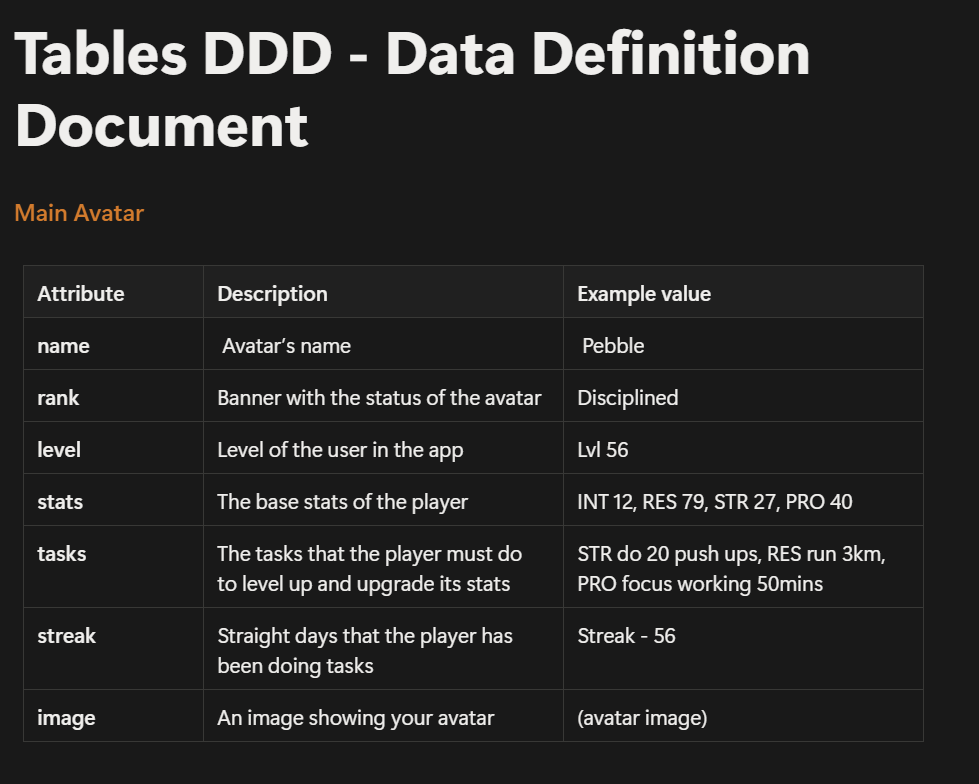
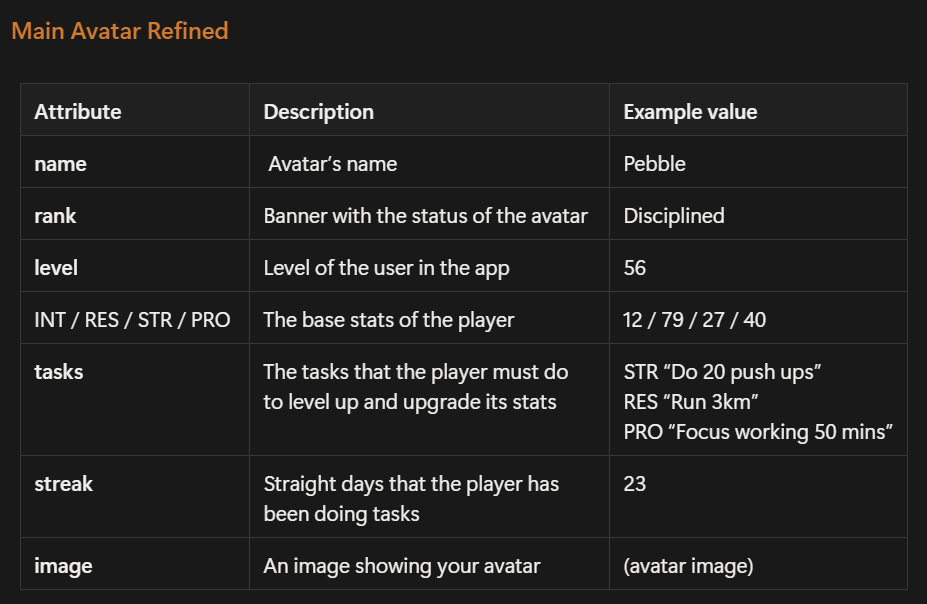
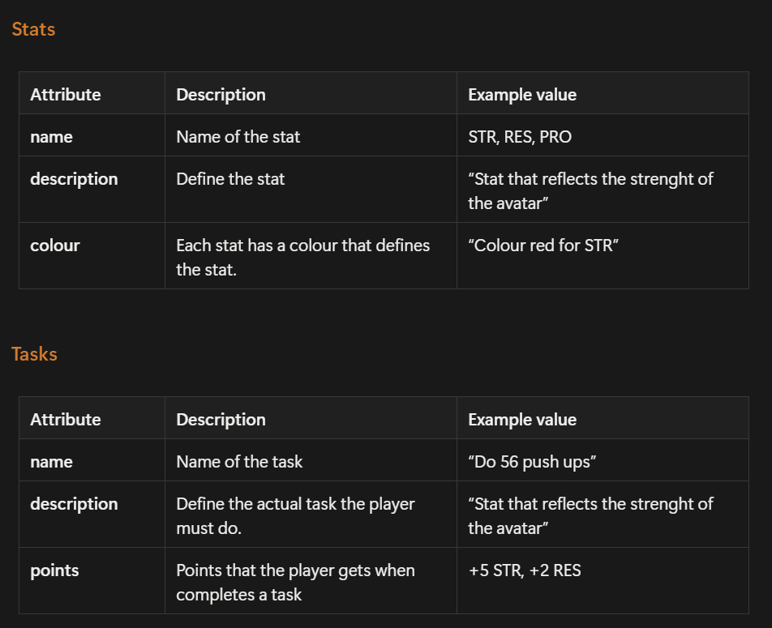
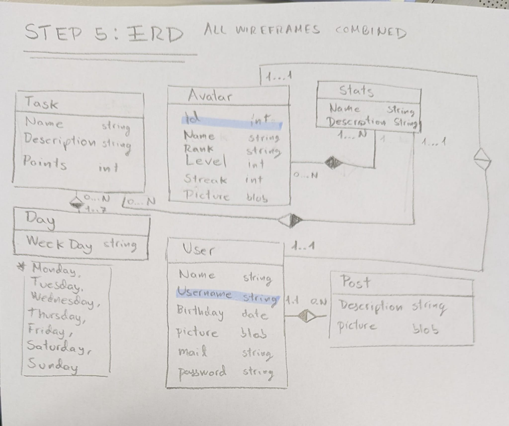

For this fourth blog, we focused on defining the internal structure of the system. After having a clear idea of the product and its main features, we had a meeting where we worked on how the data of the application would be organized and managed.

We started by creating the DDD (Data Definition Document), where we defined the main tables that will be part of the database. These tables represent the core elements of the application, such as the avatar, stats, and tasks.

The purpose of this step was not only to list attributes, but to clearly understand what kind of information each part of the system needs to store and how it contributes to the overall experience.

## Main tables definition

Through THIS table, we defined key attributes like the avatar’s name, rank, level, stats, tasks, image and streak. This helped us visualize how user progress is stored and updated.

We also refined some of these tables to make them more consistent and better aligned with the idea of the product.

## Refined structure

This refinement allowed us to simplify some relationships and make the system easier to understand from a development perspective.

After defining the tables, we moved on to creating the ERD (Entity Relationship Diagram), which represents how all these elements are connected within the database.

## Entity Relationship Diagram

In this diagram, we can see how different entities like **User**, **Avatar**, **Stats**, **Tasks**, and **Posts** are related to each other. This was a key step because it helped us understand how the system will manage interactions between users and their data.

For example, we can clearly see how a user is linked to an avatar, how tasks contribute to stats, and how posts are connected to user activity. This gives us a much clearer idea of how the backend should handle all these relationships.

Overall, this session was mainly focused on building a solid foundation for the system. By defining both the tables and their relationships, we now have a much clearer vision of how the database will work behind the scenes.