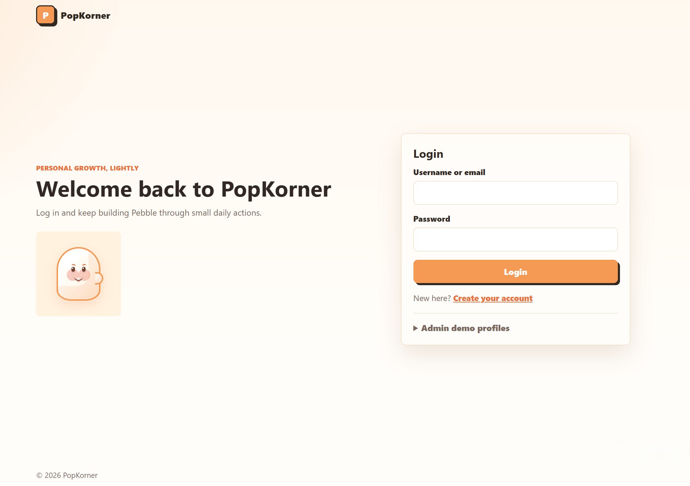
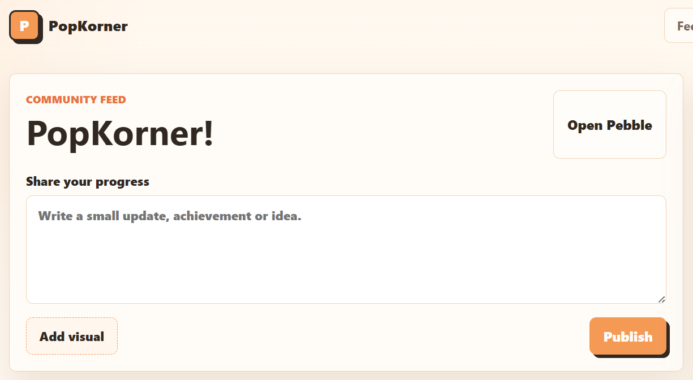
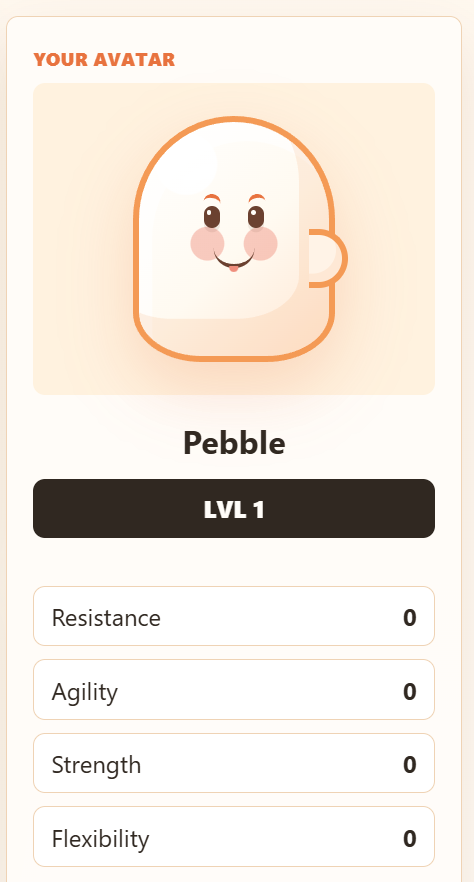
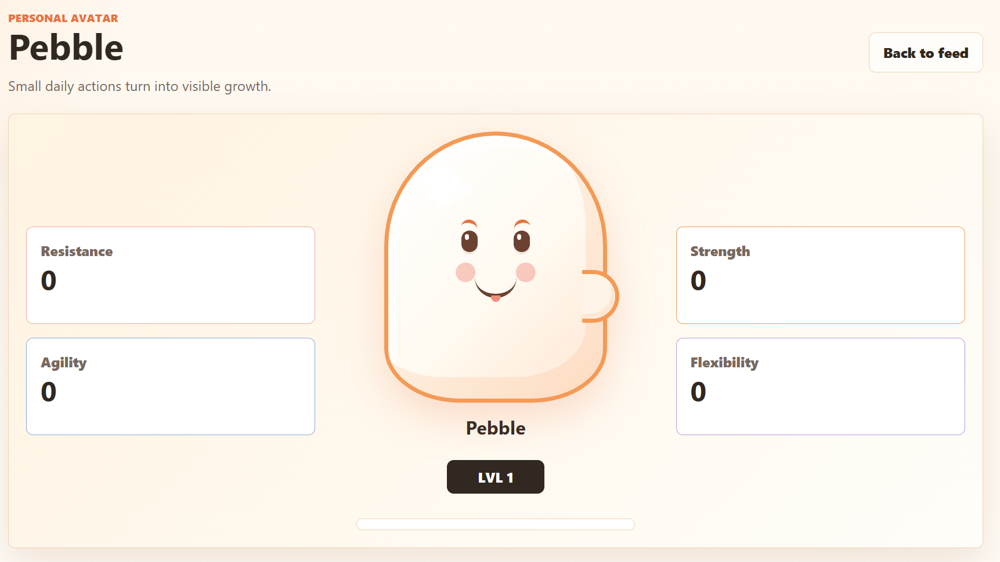
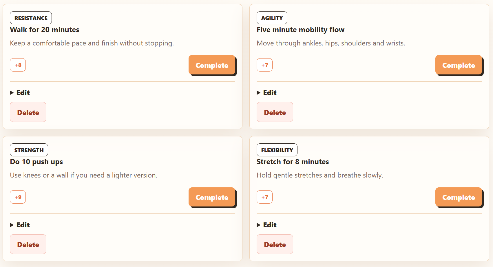

For this fifth blog, we focused on turning the previous planning work into the first functional prototype of PopKorner. The objective was not to finish the whole platform, but to check whether the core requirements could work together in a clear and realistic interface.

The first decision was to start with a simple login and register screen. As shown above, the page introduces PopKorner as a personal growth platform and gives the user a direct way to log in or create an account. This is essential because the app depends on personal data: each user needs their own avatar, stats, tasks and posts. We also included admin demo profiles, but this is mainly a development tool. It helps us test different user states quickly, although it should be hidden from normal users in the final version.

After logging in, the user arrives at the community feed. This screen connects directly to one core idea of the project: users should be able to share small progress updates and see the app as a social space, not only a private tracker. We kept the post composer simple: one text area, an optional visual button and a publish button. The visual feature could make posts more expressive, but it is not as essential as writing and publishing an update. For this reason, text posting is the minimum requirement, while image uploading can remain secondary if time becomes limited.

The avatar card shows how the personal growth concept starts becoming visible. Pebble has a level and four main stats: Resistance, Agility, Strength and Flexibility. This choice keeps the prototype focused on a sports and physical growth experience. Earlier ideas could have included more categories such as creativity, productivity or social skills, but at this stage the application is intentionally limited to a fitness-oriented avatar system. This makes the prototype easier to understand, test and implement while still demonstrating the core progression mechanics. With four clear stats, each task can be mapped directly to one area of improvement, creating a simple feedback loop for the user. In later iterations, the system could expand to support different types of avatars and alternative growth paths depending on the broader goals of the application.

The larger avatar page expands this requirement. The user can see the same stats in a more detailed layout, with the avatar placed in the centre. This supports the motivational part of the application: progress should feel visible and personal. Technically, this means the avatar page must read the user's stored stat values and update whenever tasks are completed.

The challenge cards are the clearest connection between user action and system behaviour. Each card has a category, description, reward value, complete button, edit option and delete option. Completing a task should increase the related stat, while editing and deleting support basic management of user-created tasks. We prioritised this over more complex features such as comments, leaderboards or advanced customisation because the prototype first needs to prove that daily actions can change the avatar.

For evaluation, the next stage of development will focus on adding more functionality to the prototype. One important feature is allowing users to create and add their own tasks instead of only using predefined ones. Another planned improvement is integrating an API that displays supportive and motivational messages to encourage users during their progress.

The next version should also demonstrate that posts and progress are correctly stored and shared between different user accounts when users log in separately. This will help test whether the app works as a real multi-user system, not only as a visual prototype. We also need to check basic accessibility through labelled inputs, keyboard navigation and readable button states.