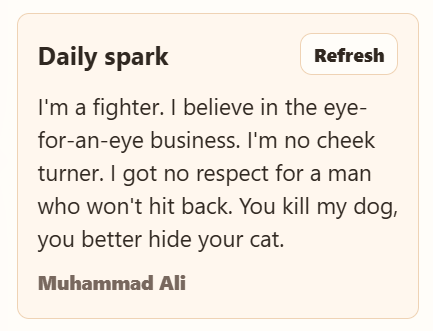
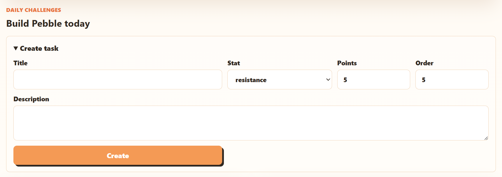
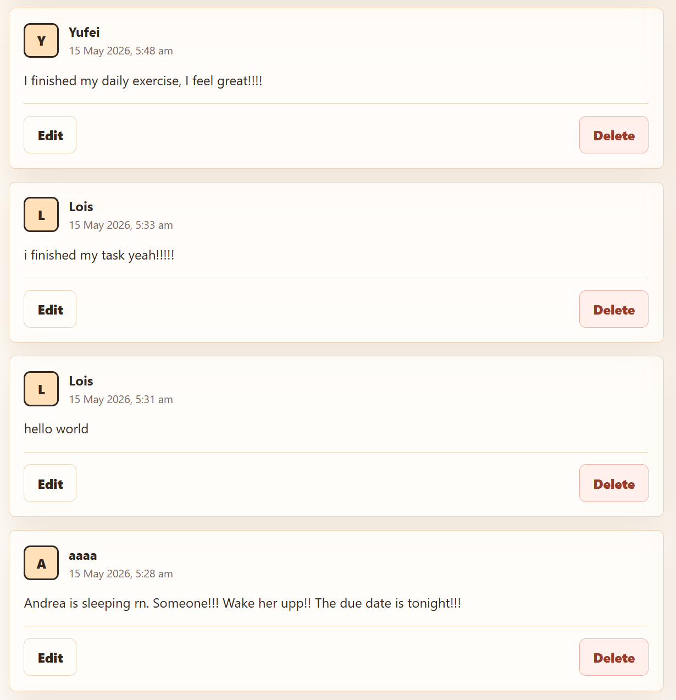

For this sixth blog, the prototype has moved from only showing the main structure of PopKorner to supporting more complete interactions. After the first functional version, we focused on improving the parts of the app that make the experience feel more personal: motivation, custom tasks and community activity.

One of the main improvements is the new **Daily Spark** feature. This section uses an API to show motivational quotes to the user. The refresh button allows the quote to change, so the user can get a new message whenever they need extra encouragement. This connects directly to the purpose of PopKorner: the app should not only track actions, but also support users emotionally while they build habits. From a technical point of view, this also helped us test how external data can be integrated into the interface.

Another important change is the **Create task** section in the daily challenges page. In the previous prototype, tasks were mainly predefined. Now, users can create their own personal tasks by adding a title, description, stat category, point value and display order. This is an important functional requirement because different users may have different goals. For example, one user may want to focus on resistance, while another may prefer flexibility or strength. Allowing custom tasks makes the app more flexible without changing the main progression system. The trade-off is that user-created tasks require more validation, because the app needs to make sure the information entered is clear, balanced and connected to one of Pebble’s stats.

We also had the opportunity to run a **think-aloud testing activity** in class. Some classmates tested the website and became our first user testers. The community feed shows how different users created posts during the session, with each post displaying the user’s name, date and message. This helped us confirm that the forum idea works better when it feels shared between real accounts, rather than only being a static design. It also showed that storing and displaying posts from multiple users is a core requirement, not an optional feature, because the community feed depends on visible interaction between users.

The think-aloud activity was useful because testers gave feedback while using the prototype. Some suggested being able to change or customise the avatar, which could make Pebble feel more personal. Others suggested adding a visual countdown timer to show how much time is left to complete tasks. Another interesting idea was making the avatar’s mood change depending on whether the user completes or misses their tasks. These ideas are not essential for the current prototype, but they show possible directions for making the app more engaging.

We also tested the prototype using some of the development checks included in the project template and explained during class, such as `npm run lint` and `npm run dev:test`. These tests helped us detect possible formatting, structure and development issues early in the process. The website passed these checks successfully, giving us confidence that the current implementation follows the expected coding standards and that the main functionality behaves correctly during development.

For the next stage, the priority is to refine these new features while keeping the scope realistic. One improvement will be integrating a countdown timer so users can clearly see how much time is left before the daily tasks refresh. We may also add a visual example on the home screen showing how to use the website, so new users can understand the main flow more quickly. Another possible improvement is avatar customisation, allowing each user to choose or change their avatar so they can identify more personally with their progress.